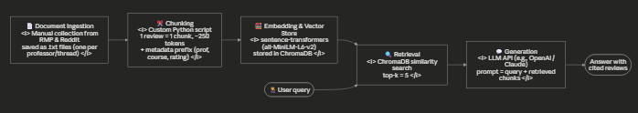

# Project 1 Planning: The Unofficial Guide

> Write this document before you write any pipeline code.
> Your spec and architecture diagram are what you'll use to direct AI tools (Claude, Copilot, etc.) to generate your implementation — the more specific they are, the more useful the generated code will be.
> Update the Retrieval Approach and Chunking Strategy sections if you change your approach during implementation.
> Update this file before starting any stretch features.

---

## Domain

<!-- What domain did you choose? Why is this knowledge valuable and hard to find through official channels? -->
My domain is student reviews and opinions of professors at Montclair State University, focused on what classes are actually like: grading style, workload, attendance policies, and whether students would take the professor again. This knowledge is hard to find otherwise because it's scattered across hundreds of individual Rate My Professors pages and buried in Reddit threads — there's no single place to ask "which CSIT professors are flexible with late work?" The official university catalog describes courses but says nothing about the real student experience of taking them.

---

## Documents

<!-- List your specific sources: URLs, subreddit names, forum threads, or file descriptions.
     Aim for at least 10 sources that together cover different subtopics or perspectives within your domain. -->
     School-wide page: https://www.ratemyprofessors.com/school/630 

| # | Source | Description | URL or location |
|---|--------|-------------|-----------------|
| 1 |https://www.ratemyprofessors.com/school/630  |School wide page  | |
| 2 |All MSU professors search: https://www.ratemyprofessors.com/search/professors/630?q=* | | |
Example professor pages I confirmed exist: https://www.ratemyprofessors.com/professor/1317879 (Conway, History),
 https://www.ratemyprofessors.com/professor/863633 (Woodard, History), 
 https://www.ratemyprofessors.com/professor/1763018 (Miller, English), 
 https://www.ratemyprofessors.com/professor/432916 (Stewart), 
 https://www.ratemyprofessors.com/professor/1581693 (Kumar),
  https://www.ratemyprofessors.com/professor/3070931 (Zhou)
| 3 | | | |
| 4 | | | |
| 5 | | | |
| 6 | | | |
| 7 | | | |
| 8 | | | |
| 9 | | | |
| 10 | | | |

---

## Chunking Strategy

<!-- How will you split documents into chunks?
     State your chunk size (in tokens or characters), overlap size, and explain why those
     numbers fit the structure of your documents.
     A review-heavy corpus warrants different chunking than a long FAQ. --> 

**Chunk size:**
 about 250 tokens or about 100 characters with one chunk per RMP review where possible. Reddit threads are split at the comment level, merging very short comments with their parent until a chunk reaches 250 tokens 
**Overlap:**
0 tokens for RMP reviews 50 tokens for long reddit comments that must be split mid tex 
**Reasoning:**
My corpus is dominated by the Rate my Professors reviews which are short 205 sentences. and self contained- each one already expresses a complete opinion about one professor's grading, worldoad or teaching style. Splitting a review in half would separate a claimn from its context . And merging multiple reviews into one chunk would blend contradictory opinions from different students causing a ruckess. So the natural unit is one review = one chunk , which makes overlapp unncessary for that portion of the corpus. Each chunk is prepended with meta data so a rerieved chunk is never an orphaned opnion with no referent. Reddit threads have the opposite structure. Facts spread accross lo9ng conversational comments so those are split per comment with a small 50 token overlap. 
---

## Retrieval Approach

<!-- Which embedding model are you using (e.g., all-MiniLM-L6-v2 via sentence-transformers)?
     How many chunks will you retrieve per query (top-k)?
     If you were deploying this for real users and cost wasn't a constraint, what tradeoffs
     would you weigh in choosing a different embedding model — context length, multilingual
     support, accuracy on domain-specific text, latency? -->

**Embedding model:** the all Mini LM fre runs locally and 384 dimensional embeddings and its 256 token input limit pairs well with my chunks

**Top-k:** 5 would be the top K

**Production tradeoff reflection:** If cost weren't a constraint, the biggest factor 
for this domain would be accuracy on informal, opinionated text. Student reviews are 
full of slang, sarcasm, and abbreviations. and a larger model like OpenAI's text-embedding-3-large or Cohere's embed-v3 captures 
the semantics of casual language better than a small distilled model. Context length 
matters less for me — my chunks are deliberately small — but it would matter if I 
switched to chunking whole Reddit threads. Multilingual support would be worth weighing 
at MSU specifically, since it's a Hispanic-Serving Institution and some students might 
query in Spanish; MiniLM is English-only, while a model like multilingual-e5 or 
embed-multilingual-v3 would let a Spanish query retrieve English reviews. The tradeoff 
against all of this is latency and infrastructure: MiniLM embeds queries in 
milliseconds on a CPU, while API-based models add network round-trips and a per-token 
cost on every single query, not just at indexing time. For a real deployment I'd 
benchmark a small/large pair on ~20 real student queries and only pay for the large 
model if retrieval quality measurably improved.

---

## Evaluation Plan

<!-- List your 5 test questions with their expected correct answers.
     Questions should be specific enough that you can judge whether the system's response
     is right or wrong. "What are good dining halls?" is too vague.
     "What do students say about wait times at [dining hall name] during lunch?" is testable. -->

| # | Question | Expected answer |
|---|----------|-----------------|
| 1 | What do students say about grading | expected answer something about how they grade  |
| 2 | Attendace policy|How they take attendace  |
| 3 | What do they think about the teaching style | How do they teach |
| 4 |What tests the give  |If there is a midterm and how hard finals are  |
| 5 | Which professor should I take for this course| If the professor is easy or hard for the course|

---

## Anticipated Challenges

<!-- What could go wrong? Name at least two specific risks with reasoning.
     Consider: noisy or inconsistent documents, missing source attribution, off-topic
     retrieval, chunks that split key information across boundaries. -->

1. Mis attribution across professors because each chunk is a single review a retrieval miss can pull in reviews of the wrong professor. Especially ones with similar names orwho teach the same course and the LLM will confidently present Professor A's "tough grader , avoid" review as if it describes Professor B in this domain that's not just an inaccuracy. it's an unfair claim about a real person's 
teaching. Mitigation: prepend professor name and course code to every chunk, and 
instruct the model in the prompt to only make claims about a professor when the 
retrieved chunk explicitly names them.

2.Selection bias presented as consensus. RMP reviews skew toward students 
with strong feelings — often the angry ones — so a professor with 6 reviews might have 
4 from one bad semester. My system can launder that bias into authoritative-sounding 
output: "students consistently report he is unhelpful" based on a handful of unhappy 
reviewers. Mitigation: the prompt instructs the model to hedge by sample size 
("a few students say...") and to surface disagreement when retrieved reviews conflict 
rather than picking a side.

---

## Architecture

<!-- Draw a diagram of your pipeline showing the five stages:
     Document Ingestion → Chunking → Embedding + Vector Store → Retrieval → Generation
     Label each stage with the tool or library you're using.
     You can use ASCII art, a Mermaid diagram, or embed a sketch as an image.
     You'll use this diagram as context when prompting AI tools to implement each stage. -->

---

## AI Tool Plan

<!-- For each part of the pipeline below, describe:
     - Which AI tool you plan to use (Claude, Copilot, ChatGPT, etc.)
     - What you'll give it as input (which sections of this planning.md, which requirements)
     - What you expect it to produce
     - How you'll verify the output matches your spec

     "I'll use AI to help me code" is not a plan.
     "I'll give Claude my Chunking Strategy section and ask it to implement chunk_text()
     with my specified chunk size and overlap" is a plan. -->

     I will be using Claude Code for the entire plan 

     

**Milestone 3 — Ingestion and chunking:** - My chunking strategy section is from sample .txt files from my corpus and expected output functions that splits RMP files into one review per chunk splits Reddit files per comment with 50 toekn overlap on oversized comments and prepends the metadata prefix  to each chunk 
To veryift it run it on my sample files and manually inspect the chunks confirm no review is split across two chunks, every chunk starts with the meta data prefix andn o chunk exceeds 250 tokens 
**Milestone 4 — Embedding and retrieval:**
My embedding model section and the starts repos existing code structure so Claude matches its conventions isntead of inventing new ones. 
The expected out put is that the Code embeds all chunks with the all miniLM l6 v2 and stores them 
**Milestone 5 — Generation and interface:**
 A command-line interface — the user types a question, the system 
prints the generated answer followed by a "Sources" list showing which professor 
pages / threads the retrieved chunks came from. Keeping the interface minimal lets 
me spend the effort on retrieval quality, which is what this project actually 
grades. If time allows, a stretch goal is a simple Streamlit page with a text box 
and answer display, since the pipeline code is identical underneath.
